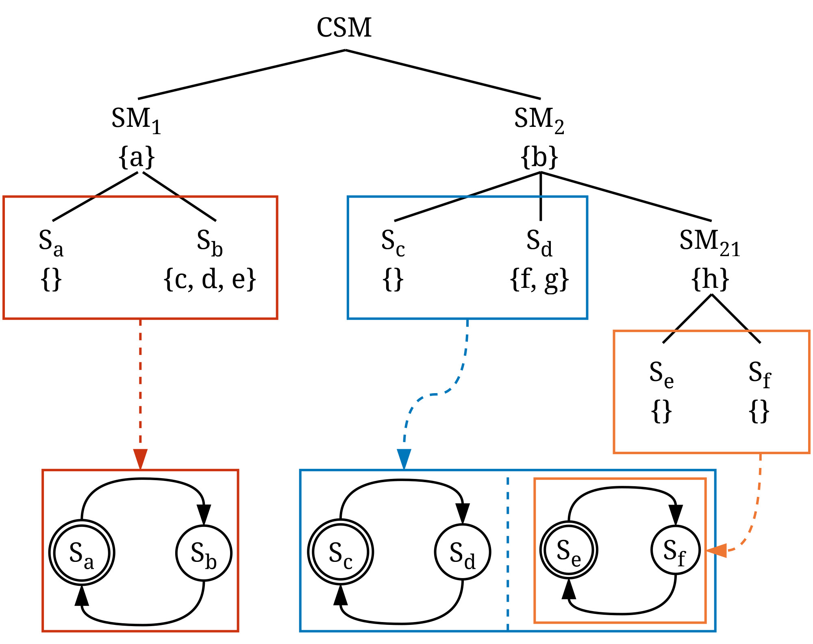

Collaborative State Machines (CSM) is a distributed programming model for the computing continuum[^1]. It
represents distributed applications as state machines that can be deployed across resources throughout the 
continuum. The model is designed for reactive, stateful, and highly dynamic applications that must operate in
heterogeneous environments.

While CSM defines the abstract programming model, its applications are expressed in the associated language,
CSML. Like the model itself, CSML is abstract and can be realized in different ways, for example through 
serialization formats or domain-specific languages. In these specifications, we describe CSML and the CSM 
concepts using the [Pkl](https://pkl-lang.org/)-based implementation of CSML employed by the official runtime
system, [Cirrina](../cirrina/runtime-system.md).

[^1]: We refer to the computing continuum as the infrastructure spanning cloud, edge, and IoT layers.

Within CSML a description consists of _constructs_, such as those describing a collaborative state machine, 
state machine and state. A construct consists of one or multiple _keywords_.

## CSM description

/// caption
Figure 1: An example of a CSM description. Components can have data represented by {...}.
///

CSML is used to create CSM _descriptions_. A description represents the static structure of an application
that is executable by a CSM runtime system.

A CSM _description_ takes the form of a tree structure. At its root is a _collaborative state machine_,
encompassing one or more _state machines_. A state machine contains one or more _states_. These fundamental
entities, collaborative state machine, state machines, and states, are called _components_. Every
component can declare _local_ and _persistent_ (globally accessible) data.

Figure 1 above illustrates a CSM tree structure. The presented collaborative state machine has two state
machines, $SM_1$ and $SM_2$, along with a nested state machine denoted as $SM_{21}$. Every state machine
has two _atomic states_. The data variables of all components are represented by $a, \ldots, h$.

