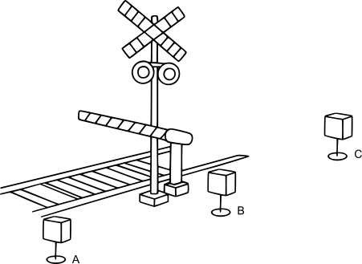
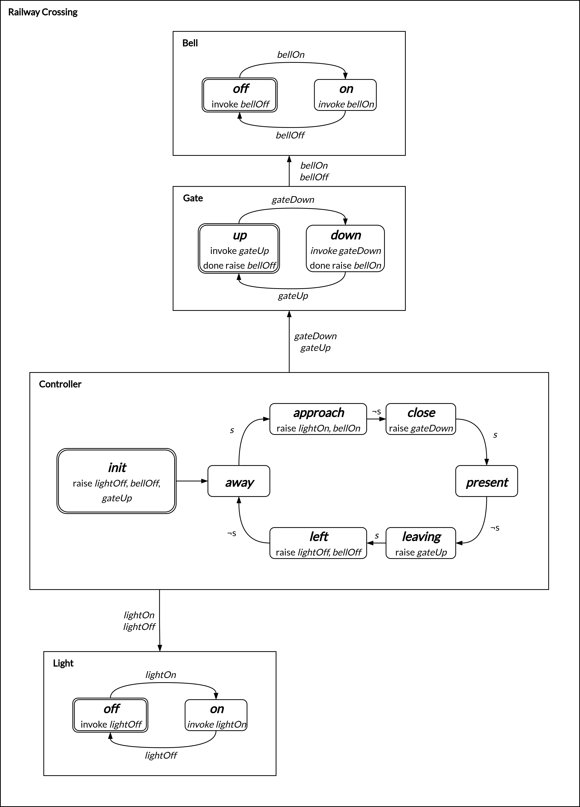

This tutorial introduces CSM through a complete yet compact example: a railway crossing controlled by four
collaborating state machines. The goal is to provide a gentle but concrete introduction to the CSM programming
model.

For the full technical details, see the [Specifications](), which formally define every aspect of CSM.

Traditional service-based approaches emphasize wiring individual services together. CSM takes a different 
path. It provides a cohesive way to describe an entire distributed system that can span cloud, edge, and IoT, 
this means:

- Less time is spent on manually integrating components.

- Focusing on modeling how the system works as a cohesive whole.

- Performance optimization becomes an inherent property of the model, rather than an afterthought.

At its core, CSM is about describing highly reactive, state machine-driven applications. Services remain
vital, they perform computation and connect to external systems, but they are framed within a model that
captures their collaboration, distribution, and semantics. This gives you both the precision of formal
modeling and the practicality of building real-world distributed applications.

!!! info
    This tutorial uses Cirrina's CSML implementation, which is built on top of [Apple's Pkl language]().
    For details specific to Pkl itself, please refer to the official Pkl documentation.<br><br>
    The complete source code for this tutorial can be found in the [Examples]().<br><br>
    If you're new to the Cirrina runtime, check out [Getting Started]() before diving into this tutorial.

---

## System overview

In this tutorial, we model a railway crossing as a distributed safety system composed of a collaborating state
machine. This example illustrates how CSM can capture reactive, distributed behavior in a way that is both
precise and intuitive.

A single crossing consists of four main components, each with a clear role in ensuring safety:

| Component      | Responsibility                                                          |
|----------------|-------------------------------------------------------------------------|
| Bell           | Provides auditory warnings to approaching traffic                       |
| Light          | Provides visual warnings through flashing signals                       |
| Gate           | Controls the physical barrier across the road                           |
| Controller     | Coordinates the other components based on sensor input                  |

!!! tip
    The **Controller** is the manager of the crossing. It does not perform physical actions itself, but it
    decides *when* each component should act.

### Sensors and train positions

The system uses three sensors placed along the track to detect train movement:

| Sensor | Location            |
|--------|---------------------|
| A      | Before the crossing |
| B      | At the crossing     |
| C      | After the crossing  |

Each sensor emits events when a train enters or leaves its detection zone. By combining these signals, the
system can determine six key train positions:

| Train Position | Description                               |
|----------------|-------------------------------------------|
| Away           | No train in range                         |
| Approach       | Train detected by sensor A                |
| Close          | Train between sensor A and B              |
| Present        | Train detected at the crossing (sensor B) |
| Leaving        | Train between sensor B and C              |
| Left           | Train past sensor C                       |

!!! tip
    Think of these positions as a "snapshot" of the train relative to the crossing. The sequence of snapshots
    guides the **Controller** in activating the warning systems.

For simplicity, we unify sensor readings into a single event:

| Event | Meaning            |
|-------|--------------------|
| `s`   | Train detected     |
| `¬s`  | Train not detected |

By tracking these events across the three sensors, the **Controller** reconstructs the train's journey and
ensures that bells, lights, and gates activate and deactivate at the correct moments.

---

## Why this model works

CSM allows us to focus on **how components collaborate** rather than on low-level wiring or implementation
details. Each component is represented as a state machine with clearly defined behavior, and the system's
overall safety emerges from their interactions.

This design is inspired by the classic work of:  
@levesonSafetyAnalysisUsing1987a

!!! tip
    In practice, this means you can model complex distributed systems, including cloud, edge, and IoT
    deployments, without losing sight of the system's reactive logic or operational requirements.

## Benefits of CSM

CSM models applications as distributable state machines that collaborate to form a single cohesive system.
Each state machine can be deployed where it makes the most sense: on IoT devices near the tracks for immediate
reactions, on edge nodes to coordinate behavior across multiple sites, or in the cloud for monitoring,
analytics, or compute-intensive tasks that permit non-real-time responses.

Using CSM provides several key advantages:

- **Local responsiveness:** Safety-critical actions, such as lowering a gate or activating a bell, happen
  immediately without relying on round-trips to the cloud.
- **System-wide semantics:** Deployment and scheduling decisions are guided by the CSM model itself, rather
  than ad hoc wiring of components.
- **Scalability:** Adding new crossings or redistributing workloads requires deploying additional state
  machines, not redesigning the entire system.
- **Maintainability:** Changes in one component do not require rewriting or manually reconnecting other
  components; the model explicitly captures collaboration.
- **Understandability:** The runtime clearly knows the system's state and how components interact. This makes
  it easier to optimize behavior, monitor the system, debug issues, and even perform formal verification.

Because a collaborative state machine provides a cohesive description of the entire system, a runtime like
Cirrina can leverage this information to automatically optimize scheduling, invocation, and placement.

Distribution, responsiveness, and performance thus become **emergent properties** of the model, rather than
features that must be manually engineered.

!!! tip
    Think of CSM as a blueprint for your system. The runtime uses this blueprint to decide *where* and *when*
    each state machine should act, letting you focus on *what* the system should do rather than on low-level
    logistics.

---

## Defining the state machines

The **Controller** state machine coordinates the other components, following the train's journey through the
crossing. Its lifecycle is:

`init → away → approach → close → present → leaving → left`

| State      | Description                                               |
|------------|-----------------------------------------------------------|
| init       | Sets initial conditions: lights and bell off, gate raised |
| away       | Idle, waiting for a train to approach                     |
| approach   | Activates lights and bell to warn traffic                 |
| close      | Lowers the gate to block the road                         |
| present    | Train is at the crossing; safety measures remain active   |
| leaving    | Raises the gate as the train departs                      |
| left       | Deactivates lights and bell, returning to idle            |

In CSM, each component is a state machine where _events_ trigger transitions. Events can be raised by other
state machines or by the environment (e.g., sensors detecting the train).

The diagram below illustrates the collaborative system with the **Controller** and the **Bell**, **Light**,
and **Gate** machines:



The **Bell**, **Light**, and **Gate** state machines represent the basic actuators of the railway crossing,
implementing simple on/off or up/down functionality. Each state corresponds to invoking a service that
performs the actual operation; turning on or off the lights, activating or silencing the bell, and raising or
lowering the gate.

The **Gate** state machine controls the **Bell**; when the gate is completely up the bell must be activated,
and when the gate is completely down the bell must be deactivated.

By modeling these components as independent state machines, CSM makes their behavior explicit and separates
**control logic** from **implementation details**, allowing the runtime to manage coordination, event
delivery, and deployment automatically.

This design also highlights one of the core benefits of CSM: flexibility. Services can be implemented in any
programming language or platform. In this tutorial, Python and FastAPI are used to provide web-based APIs for
each component. However, the same state machine model could be connected to alternative implementations, such
as simulated devices for testing, microcontroller-based hardware, or other service protocols, without
modifying the model itself.  

Furthermore, by embedding each service within a state machine, CSM ensures that interactions are
**predictable and traceable**. Every transition is triggered by an event, whether raised by the 
**Controller**, another state machine, or the environment, making the system's behavior transparent and easy
to analyze.

The **Controller** manages the system by raising events that trigger actions in the other machines:

| Triggered Event | Target Machine | Action          |
|-----------------|----------------|-----------------|
| _lightOn_       | Light          | Turn lights on  |
| _lightOff_      | Light          | Turn lights off |
| _bellOn_        | Bell           | Activate bell   |
| _bellOff_       | Bell           | Deactivate bell |
| _gateDown_      | Gate           | Lower gate      |
| _gateUp_        | Gate           | Raise gate      |

!!! tip
    The **Controller** defines *what* should happen and *when*. The runtime handles execution, ensuring
    events reach the target state machines reliably.

---

## Declaring the collaborative state machine

In CSM, every application begins with a collaborative state machine, which acts as the top-level entity
containing one or more individual state machines. This top-level structure defines how the system is composed,
coordinates the included state machines, and provides a single entry point for the runtime.

A collaborative state machine for our railway crossing example is declared as follows:

```pkl
amends "csm:Csml"
import "csm:Csml"

import "crossing.pkl"
import "bell.pkl"
import "gate.pkl"
import "light.pkl"

name    = "crossing"
version = "3.0.0"
stateMachines {
  new crossing.CrossingStateMachine {}
  new bell.BellStateMachine {}
  new gate.GateStateMachine {}
  new light.LightStateMachine {}
}
```

This declaration relies on Cirrina's `Csml` module (imported as `csm:Csml`). Every CSML application must
define a collaborative state machine, and the module is _amended_ here to provide the `name`, `version`, and
`stateMachines` fields that describe the application.

<h3>Explanation of the fields</h3>

- **`name`**
  A unique identifier for the collaborative state machine. The runtime uses this name to reference the
  collaborative state machine, which is especially important in environments where multiple collaborative
  state machines may be deployed simultaneously.

- **`version`**
  Specifies the version of the CSML language used. This ensures compatibility between the application model
  and the runtime system.

- **`stateMachines`**
  Lists the individual state machines that form the collaborative state machine. Each entry is an instance of
  a state machine class, defined in a separate `.pkl` file and brought in via the `import` statements. For
  example, `crossing.CrossingStateMachine` represents the **Controller** state machine, while
  `bell.BellStateMachine`, `gate.GateStateMachine`, and `light.LightStateMachine` correspond to the respective
  actuator components.

By declaring a collaborative state machine in this way, the runtime gains a **complete, structured view** of
the system: it knows all participating state machines, their class definitions, and can manage event delivery,
scheduling, and deployment accordingly.

This explicit declaration is fundamental to the CSM approach, making the application **composable,
distributable, and observable** from the very start.

!!! tip
    The collaborative state machine serves as the container for the entire distributed application. It
    provides a complete description of all components and their interactions, capturing the event-driven
    behavior of the system.<br><br>
    Using this description, the runtime can enable observability, optimize scheduling,
    and manage execution without the model losing its reactive semantics.

---

## Declaring the Bell state machine

The **Bell** state machine models the actuation behavior of the railway crossing bell. It responds to the
events `bellOn` and `bellOff`, transitioning between two states to reflect whether the bell is active or
silent.

The **Bell** does not perform the actual work itself. Instead, it delegates the physical operation to external
services. Each service has a **clear, isolated concern**, meaning it can be developed independently as long as
it adheres to the expected _service type_. This separation keeps the state machine focused on managing states
and transitions, while computation or integration with external systems is handled by services. The approach
simplifies modeling, enhances clarity, and allows flexible, interchangeable service implementations.

!!! note
    Since the **Bell** and **Light** state machines are all simple actuators, they share the same basic state
    machine structure. For clarity, the code for the other actuator state machines is presented alongside the
    **Bell** implementation.

### Declaring service invocation actions

Service calls are described using `Csml.InvokeAction`. For the **Bell** state machine, we define
two actions:

=== "Bell"

    ```pkl
    // Action that invokes a service that turns the bell on.
    const onAction = new Csml.InvokeAction {
      serviceType = "bellOn"
    }

    // Action that invokes a service that turns the bell off.
    const offAction = new Csml.InvokeAction {
      serviceType = "bellOff"
    }
    ```

=== "Light"

    ```pkl
    // Action that invokes a service that turns the light on.
    const lightOnAction = new Csml.InvokeAction {
      serviceType = "lightOn"
    }

    // Action that invokes a service that turns the light off.
    const lightOffAction = new Csml.InvokeAction {
      serviceType = "lightOff"
    }
    ```

Each action specifies a _service type_ (`serviceType`), such as `bellOn`. Service types define *what* should
be done, while the runtime decides *how* it is executed.

For example, the runtime might select an optimized implementation for high-performance hardware, a lightweight
version for constrained devices, or a cost-effective alternative depending on the deployment environment.

### Declaring the state machine

A state machine is defined by extending `Csml.StateMachine`.

The **Bell** state machine is declared as follows:

=== "Bell"

    ```pkl
    // Bell state machine, manages a bell.
    class BellStateMachine extends Csml.StateMachine {
      name = "bell"
      states {
        // The bell is initially off.
        new {
          name    = "off"
          initial = true
          entry { offAction }
          on {
            new {
              event  = events.bellOn
              target = "on"
            }
          }
        }
        new {
          name = "on"
          entry { onAction }
          on {
            new {
              event   = events.bellOn
              actions { onAction }
            }
          }
        }
      }
    }
    ```

=== "Light"

    ```pkl
    // Light state machine, manages a light.
    class LightStateMachine extends Csml.StateMachine {
      name = "light"
      states {
        // The light is initially off.
        new {
          name    = "off"
          initial = true
          entry { lightOffAction }
          on {
            new {
              event  = events.lightOn
              target = "on"
            }
          }
        }
        new {
          name = "on"
          entry { lightOnAction }
          on {
            new {
              event   = events.lightOn
              actions { lightOnAction }
            }
          }
        }
      }
    }
    ```

This declaration relies on the `Csml.StateMachine` class, which provides the structure for defining
a state machine in CSM. By extending this class, the **Bell** state machine specifies its name, the states it
can occupy, the initial state, entry actions, and how each state responds to incoming events. Each state
corresponds to the machine being in a particular configuration, and its behavior is driven entirely by events
raised either by the environment or other state machines.

<h4>Explanation of the fields</h4>

- **`name`**
  A unique identifier for the state machine. The runtime uses this name to reference the **Bell** state
  machine, which is important when multiple state machines are deployed within the system.

- **`states`**
  Defines all the states that the **Bell** state machine can occupy. Each state includes the actions to
  execute when entering the state and the transitions that should occur in response to specific events. This
  explicit definition allows the runtime to manage state, trigger actions, and coordinate with other state
  machines in a predictable, event-driven manner.

!!! tip
    Think of the **Bell** state machine as a **reactive component** within the collaborative system. It does
    not perform hardware operations itself; instead, it specifies *what* should happen when certain events
    occur. The runtime uses this model to coordinate actions, trigger services, and ensure predictable
    event-driven behavior.

### Declaring a state

Looking at a single state more closely:

=== "Bell"

    ```pkl
    new {
      name    = "off"
      initial = true
      entry { offAction }
      on {
        new {
          event  = events.bellOn
          target = "on"
        }
      }
    }
    ```

=== "Light"

    ```pkl
    new {
      name    = "off"
      initial = true
      entry { lightOffAction }
      on {
        new {
            event  = events.lightOn
            target = "on"
        }
      }
    }
    ```

This declaration relies on the `Csml.State` class (omitted here since the class type is implied by
the `states` field of the state machine), which provides the structure for defining a state in CSM.

Each state machine has one _initial state_, which it enters when first instantiated, and can have any number
of _final states_, where the machine terminates. All other states are considered _intermediate_ and the
machine can transition through them as events occur.

A state may define several types of _action blocks_, such as the _entry_ (`entry`) actions executed upon
entering the state, the _exit_ (`exit`) actions executed upon leaving the state, the _while_ (`while`) actions
executed continuously while the machine remains in the state, and timeout actions executed at pre-defined
intervals, if specified.

This structure allows each state to encapsulate its behavior fully, making the state machine predictable,
reactive, and easy to reason about.

<h4>Explanation of the fields</h4>

Each state has several key properties:

- **`name`**
  The unique identifier of the state.
  
- **`initial`**
  Marks this state as the starting point when the state machine is first instantiated.

- **`entry`**
  Actions to execute upon entering the state. In this case, it ensures the bell is off.

- **`on`**
  Event handlers specifying transitions or additional actions triggered by incoming events. Here, receiving
  `bellOn` transitions the machine to the `on` state.

The `on` field is paired with a list of `Csml.OnTransition` objects, which define _on-event 
transitions_. Each transition is triggered by a received event and can either move the state machine to a
new state or remain in the current state (a _self-transition_).  

Transitions can include an action block (`actions`) that executes one or more actions when the transition
occurs. They can also be _guarded_, meaning the transition only occurs if a specified condition evaluates to
`true`. This allows precise control over when and how state changes happen in response to events.

!!! tip
    Each state is a **self-contained reactive unit**. It encapsulates the actions, transitions, and behavior
    for a specific configuration of the state machine. By clearly defining states and their event-driven
    responses, you can develop, test, and reason about each part of your system in isolation while ensuring
    predictable behavior when combined with other states and machines.

### Declaring an event

In CSM, event names are represented as strings. For convenience and consistency, events are typically stored
in variables, making them easy to reference throughout the application. A declaration looks like this:

```pkl
// Raised based on a sensor reading.
sensor   = "sensor"

// Raised when the gate should be up.
gateUp   = "gateUp"

// Raised when the gate should be down.
gateDown = "gateDown"

// Raised when the light should be on.
lightOn  = "lightOn"

// Raised when the light should be off.
lightOff = "lightOff"

// Raised when the bell should be on.
bellOn  = "bellOn"

// Raised when the bell should be off.
bellOff = "bellOff"
```

---

## Declaring the Gate state machine

The **Gate** state machine models the raising and lowering of the railway crossing gate, coordinating closely
with the bell to ensure safe operation. Gate movement is initiated via service invocations. Each service
invocation can define a _done_ action block, which is executed after the service completes. For example, the
_done_ block of the gate-raising action is used to deactivate the bell once the gate is fully raised.

Before lowering the gate, the bell should be activated. By leveraging the deterministic order of actions
within an action block, the bell can be turned on *first*, followed immediately by the gate-lowering service.

As with other actuators, the **Gate** delegates the physical work to external services.

!!! tip
    The **Gate**, like the **Bell** and **Light**, follows a consistent state machine structure. Using the 
    `done` block of `Csml.InvokeAction` allows synchronization between gate operations and related
    events, such as deactivating the bell.

### Declaring actions

**Gate** actions are either `Csml.InvokeAction` or `Csml.RaiseAction`.

We define the following actions:

```pkl
// Action that invokes a service to raise the gate.
const gateUpAction = new Csml.InvokeAction {
  serviceType = "gateUp"
  done {
    new {
      name    = events.bellOff
      channel = "external"
    }
  }
}

// Action that raises the bell on event before the gate starts lowering.
const raiseBellOnAction = new Csml.RaiseAction {
  event {
    name    = events.bellOn
    channel = "external"
  }
}

// Action that invokes a service to lower the gate.
const gateDownAction = new Csml.InvokeAction {
  serviceType = "gateDown"
}
```

The _raise event action_ is defined using the `Csml.RaiseAction` class.

- **`name`** Specifies the name of the event to raise.  
- **`channel`** Determines where the event is visible. CSM supports several channel types:  
    - `internal` Handled only within the current state machine.
    - `external` Raised globally but requires explicit subscription by other state machines.
    - `global` Raised globally and automatically received by all state machines.
    - `peripheral` Raised by the environment, typically representing sensors or external inputs . 

Using external channels allows one state machine to notify others within the collaborative state machine. To
receive these events, another state machine must explicitly subscribe to the relevant channel, ensuring
controlled and predictable inter-machine communication.

### Declaring the state machine

The **Gate** state machine is declared as follows:

```pkl
class GateStateMachine extends Csml.StateMachine {
  name = "gate"
  states {
    // The gate is initially up.
    new {
      name    = "up"
      initial = true
      entry { gateUpAction }
      on {
        new {
          event  = events.gateDown
          target = "down"
        }
      }
    }
    new {
      name = "down"
      entry { 
        raiseBellOnAction
        gateDownAction
      }
      on {
        new {
          event  = events.gateUp
          target = "up"
        }
      }
    }
  }
}
```

The `up` state behaves similarly to the **Bell** and **Light** state machines introduced earlier.  

The `down` state, however, includes an entry action block that contains two actions: `raiseBellOnAction` and 
`gateDownAction`. The `raiseBellOnAction` ensures the bell is activated before the gate begins lowering, while
`gateDownAction` executes the service invocation to lower the gate.  

When the gate is raised, the bell is deactivated through the `done` action block of the `gateUpAction`. This
sequence ensures that the bell is active for the full duration of the gate movement and that all actions occur
in a predictable, event-driven order.

---

## Declaring the Controller state machine

Finally, the **Controller** state machine oversees the **Light** and **Gate** state machines by processing
events from the nearby sensors (A, B, and C) and transitioning through the sequence:

```
away → approach → close → present → leaving → left
```

At startup, the **Controller** enters a state that resets the crossing to a default configuration: the light
is off and the gate is raised. Subsequently the **Controller** reacts to sensor events to manage the arrival,
presence, and departure of trains, ensuring the coordinated activation of lights, gates, and bells.

The **Controller** also maintains a local counter that tracks how many trains have passed through the
crossing.

### Declaring the actions

**Controller** actions are either `Csml.RaiseAction` or `Csml.AssignAction`.

We define the following actions:

```pkl
// Action that raises the gate up event.
const raiseGateUpAction = new Csml.RaiseAction {
  event {
    name    = events.gateUp
    channel = "external"
  }
}

// Action that raises the gate down event.
const raiseGateDownAction = new Csml.RaiseAction {
  event {
    name    = events.gateDown
    channel = "external"
  }
}

// Action that raises the light on event.
const raiseLightOnAction = new Csml.RaiseAction {
  event {
    name    = events.lightOn
    channel = "external"
  }
}

// Action that raises the light off event.
const raiseLightOffAction = new Csml.RaiseAction {
  event {
    name    = events.lightOff
    channel = "external"
  }
}

// Action that increments the number of trains passed.
const incrementNumTrainsPassed = new Csml.AssignAction {
  variable = new {
    name = "numTrainsPassed"
    value = "numTrainsPassed + 1"
  }
}
```

An _assign action_ is created using the `Csml.RaiseAction` class and is used to update the value of
a variable through a defined _expression_.

In this example, the variable `numTrainsPassed` is incremented by assigning it the output of the expression:

```
numTrainsPassed + 1
```

During execution, `numTrainsPassed` is substituted with its current value, and the result of the expression
is stored back into the variable.

### Declaring the guards

To ensure that the **Crossing** only transitions when the train's position actually changes, the transitions
of the state machine are **guarded**. Earlier in this tutorial, we introduced the unified sensor events `s`
and `¬s`, which indicate whether a train is detected or not. These events are used inside guard conditions to
make sure transitions occur only when a change in sensor state is observed.

The guards are declared as follows:

```pkl
// Guard that passes when the event data ($value) is true.
const isEventDataTrueGuard = new Csml.Guard {
  expression = "$value == true"
}

// Guard that passes when the event data ($value) is false.
const isEventDataFalseGuard = new Csml.Guard {
  expression = "$value == false"
}
```

In this case, a **special variable** `$value` is used.

During event handling, `$value` is automatically populated with the event's data payload. Events in CSM may
carry arbitrary data, which can then be leveraged in guards.  

- `isEventDataTrueGuard` → passes when a train is present at a sensor (`s`).  
- `isEventDataFalseGuard` → passes when a train is absent at a sensor (`¬s`).  

### Declaring the state machine

Finally, we can declare the **Controller** state machine that connects all other components of the
collaborative state machines as follows:

```pkl
class ControllerStateMachine extends Csml.StateMachine {
  name = "controller"
  localContext {
    variables {
      new {
        name  = "numTrainsPassed"
        value = "0"
      }
    }
  }
  states {
    new {
      name    = "init"
      initial = true
      entry {
        raiseLightOffAction
        raiseGateUpAction
      }
      always {
        new {
          target = "away"
        }
      }
    }
    new {
      name = "away"
      on {
        new {
          event  = events.sensor
          target = "approach"
          guards { isEventDataTrueGuard }
        }
      }
    }
    new {
      name = "approach"
      entry { raiseLightOnAction }
      on {
        new {
          event  = events.sensor
          target = "close"
          guards { isEventDataFalseGuard }
        }
      }
    }
    new {
      name = "close"
      entry { raiseGateDownAction }
      on {
        new {
          event  = events.sensor
          target = "present"
          guards { isEventDataTrueGuard }
        }
      }
    }
    new {
      name = "present"
      entry { incrementNumTrainsPassed }
      on {
        new {
          event  = events.sensor
          target = "leaving"
          guards { isEventDataFalseGuard }
        }
      }
    }
    new {
      name = "leaving"
      entry { raiseGateUpAction }
      on {
        new {
          event  = events.sensor
          target = "left"
          guards { isEventDataTrueGuard }
        }
      }
    }
    new {
      name = "left"
      entry { raiseLightOffAction }
      on {
        new {
          event  = events.sensor
          target = "away"
          guards { isEventDataFalseGuard }
        }
      }
    }
  }
}
```

The `localContext` keyword defines the _local data_ of a state machine, accessible only within that machine.
Besides local data, CSM also supports _persistent data_ (globally accessible across machines) and
state-specific _static data_ (retained across state activation and deactivation).

A local variable such as `numTrainsPassed` is declared using `Csml.ContextVariable`, which
specifies:

- **`name`** 
  The identifier of the variable.

- **`value`**
  An expression that determines the variable's initial value.

---

## Conclusion

In this tutorial, we built a railway crossing safety system using CSM and the Cirrina CSML implementation.
Step by step, we modeled sensors, actuators, and a controller as state machines that together form a
predictable, reactive, and distributed system.

This example is not just theoretical, it is fully implemented as part of the Cirrina runtime system. You can
explore the complete implementation, experiment with the code, and run it yourself in the [Examples]()
section.

By studying and experimenting with this example, you will gain practical insight into:

- **How to design state machines** for sensors, actuators, and controllers.

- **How collaboration works in CSM**, using events, guards, and context variables.

- **How Cirrina executes CSM applications**, ensuring predictable and distributed behavior.

We encourage you to explore the example code, adapt it to your own scenarios, and use it as a starting point
for experimenting with **CSM in real-world applications**.
